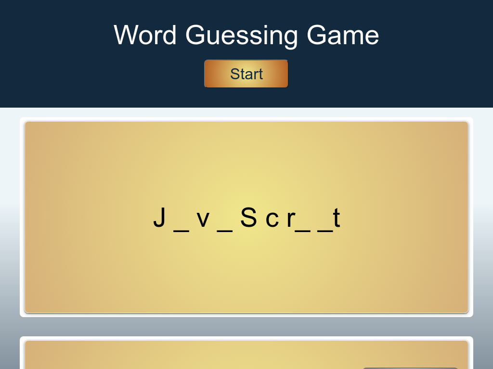

# Bootcamp Mini Project - Word Guess Game

## Description 

This project was created using HTML, CSS and Javascript to make a Word Guessing Game. The project had the following requirements:

* The game is started by clicking on a button.
* Guess the word by filling in the a number of blanks that match the number of letters in that word.
* The game is timed.
* The game is won when all the letters in the word are guesssed.
* The game is lost is the time ends and at least one letter in remaining.
* The game will display the wins and losses on the screen.

* The game should track key events of the user's key presses.
* When a user presses the correct key, it should be replace the blank space with the letter.
* When a user wins or loses the game, a message should appear.
* When a user wins or loses the timer should stop.
* When the user clicks start the timer should reset.
* The wins and loses should persist through a page refresh.

The page in this repo is the result.

## Installation

The site does not require installation steps.

## Usage 

The website can be viewed at [https://bowseruk.github.io/word-guess-game/](https://bowseruk.github.io/word-guess-game/) with Google Chrome. The source can be viewed in Chrome by right clicking and selecting inspect.

## Credits

This site was based on a project by edX Boot Camps LLC.

[W3School](https://www.w3schools.com/) was used as a reference for elements to use and good practice.

The changes were checked with [W3C Validator](https://validator.w3.org/).

[Stack Overflow](https://stackoverflow.com/) always seems to have the answer to a problem that occurs.

[MDN](https://developer.mozilla.org/en-US/) is a very comprehensive and useful resource.

## License

This project uses the licence in the LICENCE file of the repo.